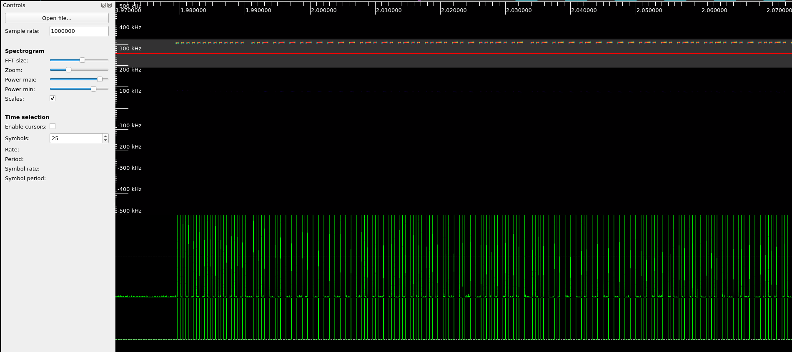
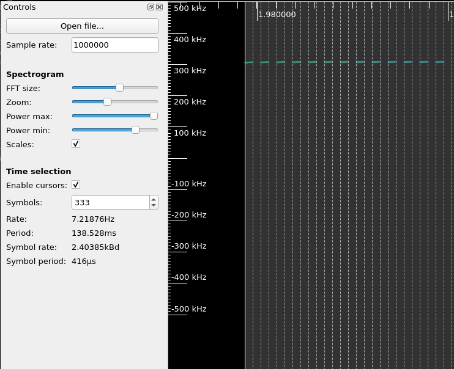

Raspberry pico - Tesla charging port opener
===

Tesla's charging port signal has been known for years. There are several projects about how to retransmit it, how to sample it for HackRF or other SDR's and how to transmit it from a microcontroller or a Raspberry Pi. However, I couldn't find a micropython implementation.

The signal has simple ASK/OOK modulation with 2.5 kHz of sample rate, easy enough to attempt a microcontroller micropython implementation.

For more information about the Tesla's charging port signal and how to reverse engineer it:

* [Original tweet](https://twitter.com/IfNotPike/status/1507818836568858631)
* [HackRF based](https://github.com/rgerganov/tesla-opener)
* [How to reverse engineer](https://github.com/akrutsinger/tesla-charge-port-signal)

How to use
===

Components
---

    * Raspberry Pico
    * 433.92 MHz transmitter for Europe (315 MHz for USA)
        * FS1000A   - Meh, it may work or it may not, pray 
        * STX882    - Much better option
    * Antenna or 17 cm of wire [Optional]
    * A way to connect everything

Assembly
---

1. Connect/solder the pins from the transmitter to the pico
    * VCC -> VBUS
    * GND -> GND
    * DATA -> GP0   (change the code if you prefer another pin)

2. Flash the pico with micropython: [official documentation](https://www.raspberrypi.com/documentation/microcontrollers/micropython.html).

3. Load the main.py file to the pico.

Use
---

You may connect the pico to your phone or get a battery for power on the go :)

Note
---

The script blinks the led of the pico automatically. If you are using a Raspberry pico W change the Pin defnition accordignly ([link](https://forums.raspberrypi.com/viewtopic.php?t=336836)).

Results
===

I've added a recorded signal generated with the pico to the docs folder, sampled at 1MHz with an RTL-SDR.

The raw signal looks like this in [Inspectrum](https://github.com/miek/inspectrum).

Once we adjust the min and max power values, we can add an amplitude plot and check that it can really be decoded to the original signal.

    101010101010101010101010100010101100101100110010110011001100110011001011010011010010110101001010110100110100110010101011010010110001010110010110011001011001100110011001100101101001101001011010100101011010011010011001010101101001011000101011001011001100101100110011001100110010110100110100101101010010101101001101001100101010110100101

Adjustments
===

The transmitted signal should have a symbol period of 400us. This is indicated with micropython's call `sleep_us(400)`. However, due to delays in micropython or the cheap transmitter I'm using, I was getting pulses of 416us. Seems little but it's a huge difference after the 333 symbols of the signal, and it was not able to open the charging ports.

Therefore, I changed the call to `sleep_us(384)` and it fixed the issue.

You may need to play a bit with this parameter to make it work  `¯\_(ツ)_/¯`
